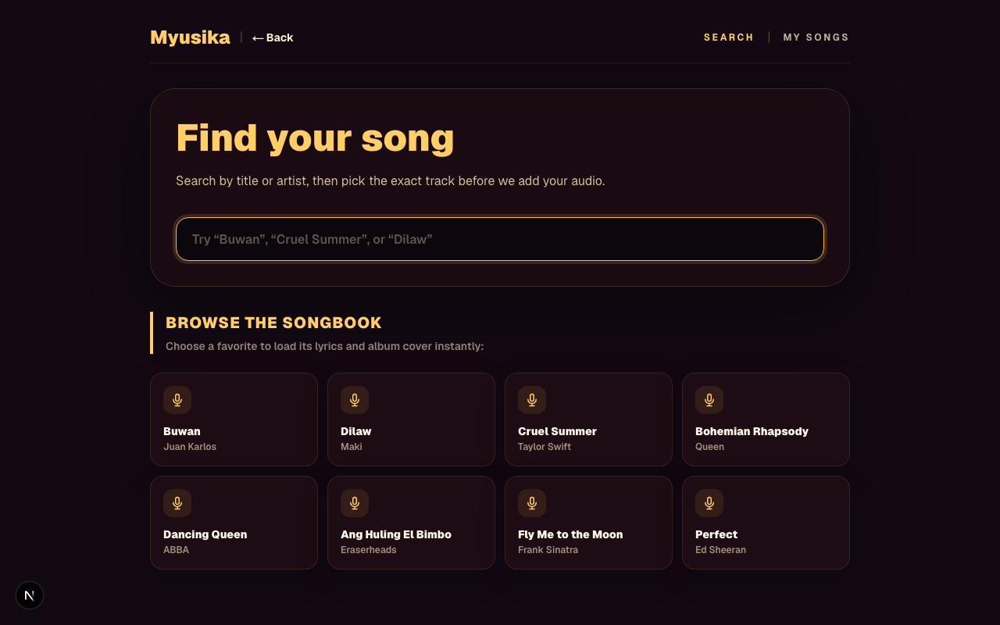
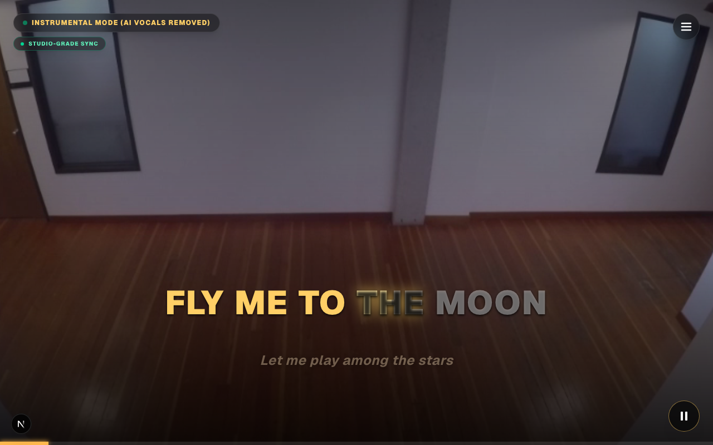
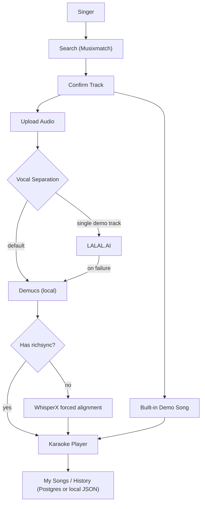

<p align="center">
  
</p>

<h1 align="center">Myusika</h1>

<p align="center">
  <strong>Search a song. Strip the vocals. Sing it karaoke-style.</strong>
</p>

<p align="center">
  <a href="https://github.com/thanreiz/musicathon"></a>
  <a href="#"></a>
  <a href="#"></a>
  <a href="https://github.com/thanreiz/musicathon/commits/main"></a>
</p>

---

## Musicathon 2026

Myusika is a Filipino-culture karaoke/videoke web app, built for **Musicathon 2026**.

> **Judge links**
>
> - **Live deployment:** [https://thanreiz-musicathon.vercel.app](https://thanreiz-musicathon.vercel.app) *(fully functional end-to-end, including direct-to-cloud vocal separation!)*
> - **GitHub Repository:** [https://github.com/thanreiz/musicathon](https://github.com/thanreiz/musicathon)
> - **Demo video:** [https://youtu.be/wriZY_uQ82U](https://youtu.be/wriZY_uQ82U)
> - **Pitch deck:** [https://canva.link/z86ycokn4r0ij2l](https://canva.link/z86ycokn4r0ij2l)
> - **Screenshots:** [see below](#screenshots)

---

## Problem

Karaoke/videoke is a everyday fixture of Filipino social life, but getting a
clean, properly-timed sing-along version of *your* song is hit or miss:

| Pain point | What it costs |
| --- | --- |
| Karaoke videos online are hit-or-miss | Wrong key, mistimed lyrics, or missing the song entirely — especially OPM |
| Lyrics are rarely synced word-by-word | Singers either guess the timing or read whole lines with no sense of pacing |
| Vocal-removal tools are paid, separate apps | An extra app, an extra subscription, before you've even picked a song |
| No simple way to bring your own track | If it's not in someone's pre-made karaoke catalog, you're out of luck |

The root problem: turning an arbitrary song into a karaoke-ready experience
takes several disconnected tools. Myusika collapses that into one flow: search,
upload, sing.

## Vision

Make any song — English hit or OPM favorite — singable karaoke-style in under
a minute, with real word-level timing instead of a rough guess.

## Purpose

Myusika helps anyone who wants to sing:

- Search a song and pull studio-grade synced lyrics from Musixmatch
- Upload their own copy of a song and strip the vocals locally (Demucs)
- Get word-level lyric timing even for songs without official sync, via
  WhisperX forced alignment
- Sing on a full-screen videoke display with key transposition and adjustable
  timing calibration
- Save sessions to a personal **My Songs** library
- Try the whole experience instantly via 3 built-in demo songs — no setup,
  no upload required

## Screenshots

| Home | Search |
| --- | --- |
|  |  |

### Karaoke Screen (live, mid-playback)



---

## Features

### Core Experience

- Search any song via Musixmatch, or browse a curated OPM/English songbook
- Full-screen videoke display with looping background video
- Per-word lyric highlighting, with melisma/held-note handling
- Instrumental-break detection with an on-screen banner
- Key transposition and adjustable lyric-timing calibration from the in-app
  settings menu

### Vocal Separation & Sync

- Local Demucs vocal removal — the default path for any uploaded track
- Optional LALAL.AI path for a single designated demo track, with automatic
  fallback to Demucs on any failure
- WhisperX forced alignment for songs without official word-level richsync,
  falling back to an estimated line-spread timing if WhisperX is unavailable
- **"Studio-grade sync"** vs **"Auto-synced (approximate)"** badges, so the
  singer always knows which timing source they're getting

### Library & Demo Songs

- **My Songs** library, auto-saved on successful upload
- Session history backed by Neon Postgres if configured, else a local JSON
  file under `data/`
- 3 built-in demo songs ("Perfect," "Ang Huling El Bimbo," "Fly Me to the
  Moon") ship with the app — full experience with zero setup

### Local-First Processing

- Demucs and WhisperX run as local Python processes by design — not on Vercel
- A deployed build returns a clear "run locally" message on upload instead of
  failing silently

---

## Tech Stack

| Layer | Technology |
| --- | --- |
| Framework | Next.js (App Router) + TypeScript |
| Styling | Tailwind CSS |
| Lyrics & metadata | Musixmatch API — search, richsync, LRC |
| Vocal separation | Demucs (local, default) + optional LALAL.AI (single demo track) |
| Forced alignment | WhisperX (optional — non-richsync songs) |
| History / persistence | Neon Postgres (optional) or local JSON fallback |
| Tests | Vitest |

---

## Run Locally

```bash
cp .env.local.example .env.local   # then fill in values
npm install
npm run dev                        # http://localhost:3000 (port is pinned)
```

### Local processing prerequisites (for upload / vocal removal)

Demucs (default vocal separation), via Python:

```bash
pip install demucs soundfile certifi
# ffmpeg must be installed and on PATH
```

WhisperX (optional — auto-alignment fallback for songs without word-level richsync):

```bash
pip install whisperx
```

If WhisperX is not installed, non-richsync songs still work using an
estimated line-spread timing, shown in the UI as **"Auto-synced
(approximate)"** (vs. **"Studio-grade sync"** for Musixmatch richsync).

### Build

```bash
npm run build
```

---

## Environment

| Variable | Required | Purpose |
| --- | --- | --- |
| `MUSIXMATCH_API_KEY` | yes | Song search + synced lyrics |
| `LALAL_API_KEY` | optional | LALAL.AI vocal separation |
| `LALAL_DEMO_TRACK_ID` | optional | Musixmatch `commontrack_id` of the one track LALAL should handle. Blank = Demucs for everything. Any LALAL failure falls back to Demucs. |
| `DATABASE_URL` | optional | Neon Postgres for history; blank = local JSON under `data/` |
| `CYANITE_API_KEY`, `SONGSTATS_API_KEY` | optional | Unused in current scope |

---

## Demo Flow

1. Open the app and pick a built-in demo song — no setup needed.
2. Or search for any song via Musixmatch and confirm the right track.
3. Upload your own audio file of that song (MP3, WAV, M4A, OGG, FLAC — up to 20 MB).
4. Wait for local vocal separation (Demucs, typically 30–90 seconds) — instant for built-ins.
5. Sing along on the full-screen karaoke display; adjust key, lyric size, and timing from the settings menu.
6. Your session auto-saves to **My Songs** for next time.

## Architecture



---

## Roadmap

| Phase | Focus |
| --- | --- |
| Phase 1 | Project scaffold (Next.js, Tailwind, Vercel config) |
| Phase 2 | Musixmatch search & confirm flow |
| Phase 3 | Audio upload + vocal separation pipeline |
| Phase 4–5 | Richsync karaoke player, key transposition, session history, videoke redesign |
| Stability rounds | Lyric-sync fixes, instrumental-break detection, repo/audit cleanup |
| Latest | WhisperX forced alignment, sync-source badges, built-in demo songs, optional LALAL primary path |

---

## Team

**Ethan Dreiz Baltazar**
Builder, designer, and developer of Myusika.

- Instagram: [@thanreiz](https://www.instagram.com/thanreiz)
- LinkedIn: [thanreiz](https://www.linkedin.com/in/thanreiz)
- GitHub: [thanreiz](https://github.com/thanreiz)

---

## Notes

- API keys are read only in server-side route handlers under `/app/api` and
  never reach the browser. Do not hardcode keys; keep them in `.env.local`
  (gitignored).
- `data/` and `public/separated/` hold per-user generated files and are
  gitignored.

---

> Project status: Demo-ready web app for Musicathon 2026, with local Demucs
> vocal separation, Musixmatch synced lyrics, WhisperX-assisted alignment for
> non-richsync tracks, and three built-in demo songs requiring zero setup.
